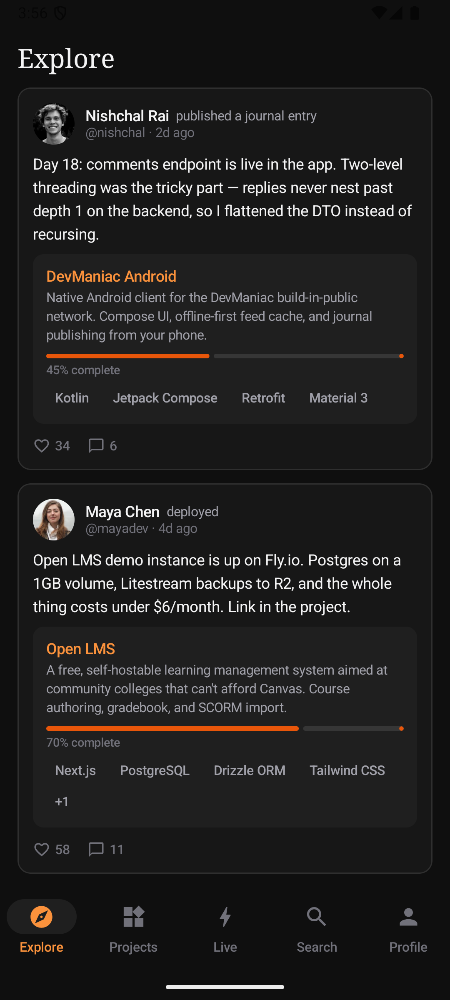
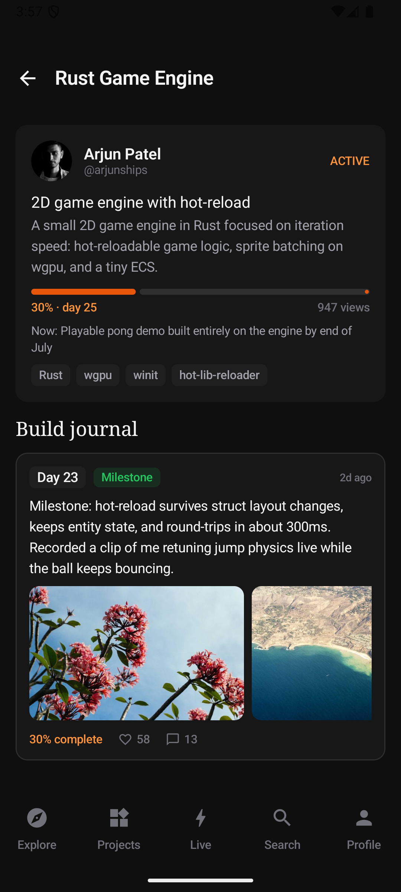
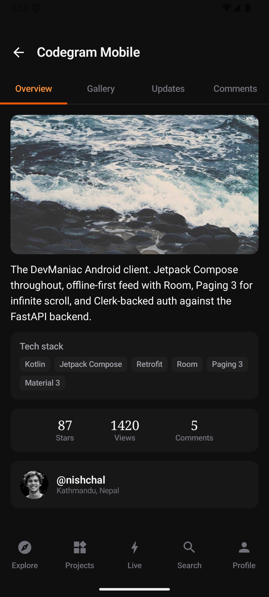
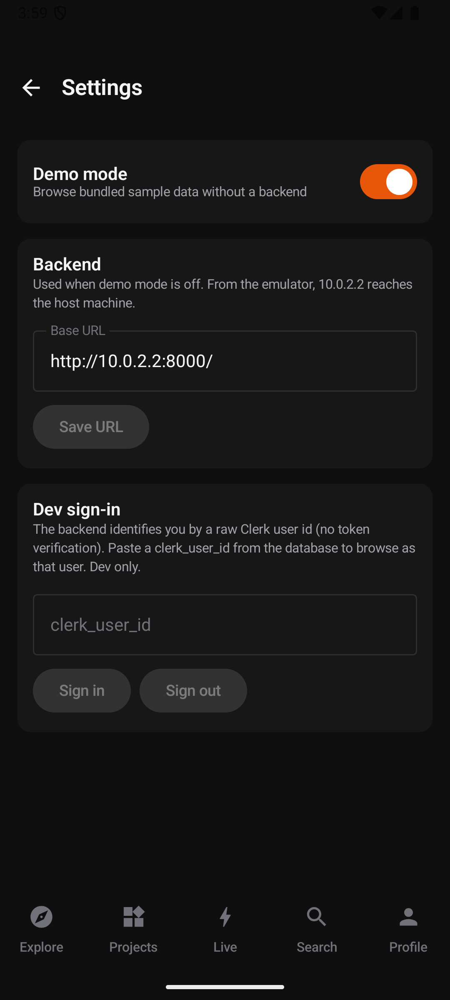

# DevManiac — Android Port

Native Android client for **DevManiac**, a build-in-public social platform for developers: declare live projects, log build-journal sessions publicly, ship milestones, and let your build history speak as your portfolio. (Upstream project description: [docs/UPSTREAM-README.md](docs/UPSTREAM-README.md).)

This repository contains three peers:

| Directory | What it is |
|---|---|
| `android/` | **Native Android app** — Kotlin, Jetpack Compose, Material 3 (this port's main deliverable) |
| `web/` | Original web frontend — Next.js 16 (App Router), React 19, Tailwind v4, Clerk |
| `backend/` | Shared REST API — Python FastAPI, PostgreSQL (async SQLAlchemy), Alembic |

## The Android app

| Explore feed | Journal timeline | Project detail | Settings |
|---|---|---|---|
|  |  |  |  |

A read-first MVP that mirrors the web app's mobile layout (bottom navigation, dark burnt-orange theme):

- **Explore** — the public feed of build events (journal entries, live-project launches, deployments, milestones)
- **Projects** — cursor-paginated project cards; detail view with Overview / Gallery / Updates / Comments tabs and threaded comments
- **Live** — in-progress builds with progress bars and a day-numbered **build journal timeline**: entry-type badges, code snippets, media grids, problem→solution blocks
- **Search** — debounced builder search
- **Profile** — public profiles with stats, current build, and links
- **Settings** — demo mode toggle, backend base URL, dev sign-in

### Demo mode (default)

The app ships with bundled fixture data (`android/app/src/main/assets/fixtures/`) served through the same DTOs and repository interface as the live API — so a fresh install is fully browsable **without running the backend**. Flip it off in Settings to talk to a real backend.

### Quick start

```bash
cd android
./gradlew assembleDebug          # requires JDK 17 and the Android SDK
adb install -r app/build/outputs/apk/debug/app-debug.apk
```

Full Windows setup steps: [docs/BUILD.md](docs/BUILD.md).

## Documentation

- [docs/ARCHITECTURE.md](docs/ARCHITECTURE.md) — app architecture, module layout, data flow
- [docs/API.md](docs/API.md) — backend endpoint inventory, auth model, pagination quirks
- [docs/BUILD.md](docs/BUILD.md) — building and running on Windows (CLI-only, no Android Studio required)
- [docs/PORTING-NOTES.md](docs/PORTING-NOTES.md) — web → Android mapping decisions and known gaps

## Running the original stack

- **Backend**: Python 3.14 + Poetry + PostgreSQL — `uvicorn app.main:app` from `backend/` (see `backend/pyproject.toml`)
- **Web**: pnpm — `pnpm install && pnpm dev` from `web/` (needs Clerk keys; note the code reads `NEXT_PUBLIC_BACKEND_URL`)

## License

See [LICENSE](LICENSE) — the upstream project is all-rights-reserved; this port exists for learning and demonstration.
